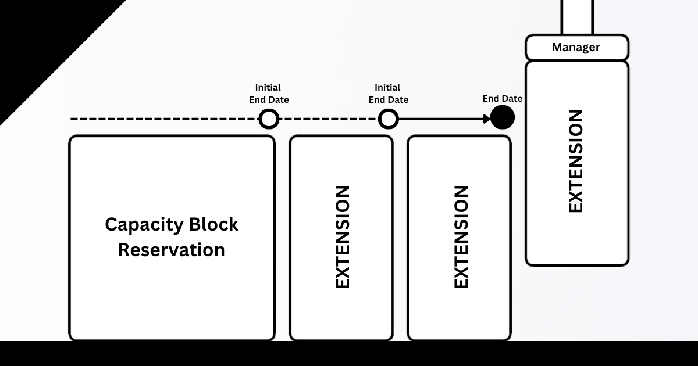
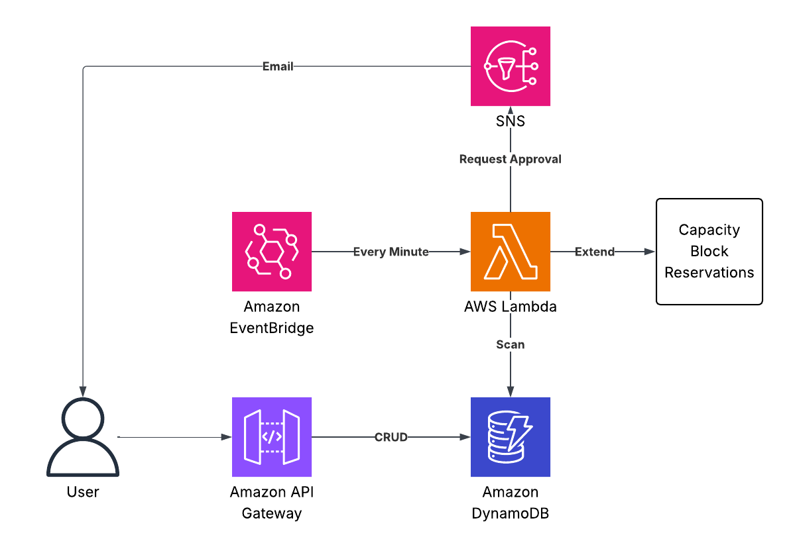

# Capacity Block Manager (CBM)

This project automates management of AWS Capacity Block compute environments using a CDK-deployed API and Lambda function. It supports extension logic, approval workflows, and secure API-key-based access.

## 🔍 Overview

The Capacity Block Manager (CBM) helps you:

- Track and manage AWS Capacity Block reservations
- Automate extension workflows for existing capacity blocks
- Implement approval processes for capacity changes
- Securely manage compute environments via API

## 🏗️ Architecture 



The Capacity Block Manager follows a simple yet effective architecture:

1. **EventBridge Rule**: A scheduled EventBridge rule runs every minute, triggering the Capacity Block Manager Lambda function.

2. **Lambda Function**: The Lambda function scans the DynamoDB table for capacity block records and processes each one:
   - Checks if capacity blocks are approaching their expiration date
   - Determines if extensions require approval based on configuration
   - Extends capacity blocks automatically or sends approval requests

3. **DynamoDB**: Stores all capacity block records with their configuration, status, and expiration details.

4. **SNS Topic** (Optional): When approval is required, notifications are sent to the configured email address.

5. **API Gateway**: Provides a RESTful API for managing capacity block records:
   - Creating and updating capacity block configurations
   - Approving extension requests
   - Retrieving status information

6. **Secrets Manager**: Securely stores the API key used for authentication.

This serverless architecture ensures reliable, automated management of capacity blocks with minimal operational overhead. The system continuously monitors your capacity blocks and takes appropriate action based on your configured policies.

---

## 🎯 Key Use Cases

### Continuous Capacity Management

For workloads that require uninterrupted access to reserved compute capacity:

- **Automated Capacity Extension**: Automatically detect when capacity blocks are approaching expiration and extend them without manual intervention
- **Continuous Workload Support**: Ensure critical workloads maintain access to specialized instance types (like GPU instances) without interruption
- **Capacity Planning**: Track usage patterns and automate requests for capacity based on historical needs
- **Cost Optimization**: Maintain the right balance between on-demand and reserved capacity to optimize costs

### Approval-Based Extension Workflows

For organizations that need governance over capacity extensions:

- **Expiration Notifications**: Receive timely alerts when capacity blocks are approaching their end date
- **Approval Workflows**: Implement governance processes requiring explicit approval before extending capacity commitments
- **Financial Controls**: Enable finance teams to review and approve capacity extensions that have budget implications
- **Capacity Justification**: Document the business case for extending capacity blocks through the approval process

The solution is particularly valuable for:
- ML/AI workloads requiring consistent access to GPU instances
- Financial services with predictable, high-performance computing needs
- Research teams with long-running computational workloads
- Enterprise applications with strict SLAs requiring guaranteed capacity

---

## 🔧 Deployment Instructions

1. **Install dependencies**

```bash
npm install
```

2. **Deploy the stack**

```bash
# Deploy without email notifications
npx cdk deploy

# OR deploy with email notifications for approval workflow
ADMIN_EMAIL=your.email@example.com npx cdk deploy
```

This will:

- Create a DynamoDB table
- Deploy a Lambda function
- Deploy an API Gateway with API key authentication
- Generate and store the API key in AWS Secrets Manager
- If ADMIN_EMAIL is set:
  - Create an SNS topic for approval notifications
  - Subscribe the provided email address to the topic
- Output the following **SSM parameters**:
  - `/cbm/<StackName>/apiSecretName` — name of the secret containing the API key
  - `/cbm/<StackName>/apiUrl` — the full URL of the deployed API

### Approval Workflow

The approval workflow is optional and depends on whether you set the ADMIN_EMAIL environment variable during deployment:

- **With ADMIN_EMAIL set**: The system will send email notifications when capacity blocks require approval for extension. The specified email address will receive these notifications.
- **Without ADMIN_EMAIL set**: The approval workflow is disabled, and capacity blocks marked as requiring approval will be automatically approved.

---

## 📡 Using the API

Once deployed:

1. Look at the CloudFormation output:
   - `ApiSecretName` → name of the Secrets Manager entry holding the API key
   - `ApiUrlSSMParameter` → parameter name in SSM for the API Gateway URL

2. Use your preferred AWS tooling to retrieve values:

```bash
aws ssm get-parameter --name /cbm/CapacityBlockManagerStack/apiUrl
aws ssm get-parameter --name /cbm/CapacityBlockManagerStack/apiSecretName
```

3. Retrieve the API key from Secrets Manager:

```bash
# First get the secret name
SECRET_NAME=$(aws ssm get-parameter --name /cbm/CapacityBlockManagerStack/apiSecretName --query "Parameter.Value" --output text)

# Then retrieve the actual API key
API_KEY=$(aws secretsmanager get-secret-value --secret-id $SECRET_NAME --query "SecretString" --output text)
```

4. Get the API URL:

```bash
API_URL=$(aws ssm get-parameter --name /cbm/CapacityBlockManagerStack/apiUrl --query "Parameter.Value" --output text)
```

---

## 🧪 Test Script Example

See [`test/seed_compute_envs_via_api.py`](./test/seed_compute_envs_via_api.py):

- Fetches the API key and URL from SSM
- Looks up active Capacity Block reservations
- Posts entries to the API using `POST`
- Can be used to test both approval and non-approval workflows

> **Note:** Be sure to set the correct AWS credentials/profile with access to SSM, Secrets Manager, and EC2 DescribeCapacityReservations.

---

## 📚 API Reference

All requests must include the `x-api-key` header with your API key.

### Supported Methods

| Method  | Endpoint      | Description                        | Path Parameters  |
|---------|---------------|------------------------------------|------------------|
| `GET`   | `/`           | List all compute environments      | None             |
| `GET`   | `/{PK}`       | Get one environment by PK          | `PK` (required)  |
| `POST`  | `/`           | Create a new compute environment   | None             |
| `PUT`   | `/{PK}`       | Update an existing environment     | `PK` (required)  |
| `DELETE`| `/{PK}`       | Delete by PK                       | `PK` (required)  |
| `PATCH` | `/{PK}`       | Approve an environment             | `PK` (required)  |

### Data Model

Compute environment objects have the following structure:

```json
{
  "PK": "string",                  // Primary key (unique identifier)
  "capacityReservationId": "string", // AWS Capacity Reservation ID
  "instanceType": "string",        // EC2 instance type
  "availabilityZone": "string",    // AWS Availability Zone
  "platform": "string",            // Platform (e.g., "Linux/UNIX")
  "tenancy": "string",             // Tenancy type
  "startDate": "string",           // ISO date string
  "endDate": "string",             // ISO date string
  "instanceCount": number,         // Number of instances
  "approved": boolean,             // Approval status
  "createdAt": "string",           // ISO date string
  "updatedAt": "string"            // ISO date string
}
```

### Example API Requests

#### List All Compute Environments

```bash
curl -X GET $API_URL \
  -H "x-api-key: $API_KEY" \
  -H "Content-Type: application/json"
```

#### Get a Specific Compute Environment

```bash
curl -X GET "$API_URL/{PK}" \
  -H "x-api-key: $API_KEY" \
  -H "Content-Type: application/json"
```

#### Create a New Compute Environment

```bash
curl -X POST $API_URL \
  -H "x-api-key: $API_KEY" \
  -H "Content-Type: application/json" \
  -d '{
    "PK": "env-123",
    "capacityReservationId": "cr-0123456789abcdef0",
    "instanceType": "p4d.24xlarge",
    "availabilityZone": "us-east-1a",
    "platform": "Linux/UNIX",
    "tenancy": "default",
    "startDate": "2025-01-01T00:00:00Z",
    "endDate": "2025-06-30T23:59:59Z",
    "instanceCount": 8,
    "approved": false
  }'
```

#### Update an Existing Compute Environment

```bash
curl -X PUT "$API_URL/{PK}" \
  -H "x-api-key: $API_KEY" \
  -H "Content-Type: application/json" \
  -d '{
    "instanceCount": 16,
    "endDate": "2025-12-31T23:59:59Z"
  }'
```

#### Approve a Compute Environment

```bash
curl -X PATCH "$API_URL/{PK}" \
  -H "x-api-key: $API_KEY" \
  -H "Content-Type: application/json"
```

#### Delete a Compute Environment

```bash
curl -X DELETE "$API_URL/{PK}" \
  -H "x-api-key: $API_KEY"
```

### Response Formats

Successful responses will return:

```json
{
  "statusCode": 200,
  "body": "..."  // JSON string containing result data
}
```

Error responses will return:

```json
{
  "statusCode": 400,  // Or other appropriate error code
  "body": "Error message"
}
```

---

## 🔒 Security Considerations

- The API is secured using API key authentication
- API keys are stored in AWS Secrets Manager
- Access to the API should be restricted to authorized personnel
- Consider implementing additional IAM policies to restrict access to the API Gateway

---

## 🛠️ Troubleshooting

Common issues:

1. **API Key Issues**: Ensure the API key is correctly retrieved from Secrets Manager and included in the `x-api-key` header
2. **Permission Issues**: Check IAM permissions for accessing DynamoDB, Secrets Manager, and SSM
3. **Deployment Failures**: Verify AWS credentials and region settings

---
